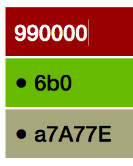

hex2rgb
=======

Converts hex color to rgb and calculates appropriate corresponding foreground.

[](https://www.npmjs.com/package/hex2rgb) [](https://github.com/glnster/hex2rgb) [](https://travis-ci.org/glnster/hex2rgb) [](https://codeclimate.com/github/glnster/hex2rgb)


## Example

For a dark hex color, hex2rgb will give you the rgb equivalent. It will also calculate and return an appropriate constrasting foreground (either 'black' or 'white').

Here's hex2rgb in action. Note the black or white text color (foreground) based on the background color.



## Installation

via NPM:

`npm install hex2rgb --save`

via Bower:

`bower install hex2rgb --save`

## Usage

### Using Bower

Include `hex2rgb.js` in your web app and use it as usual:

```js
<script src="hex2rgb.js"></script>
<script>
	hex2rgb('0033ff').rgb; // => [0, 51, 255]
	hex2rgb('0033ff').rgbString; // => 'rgb(0, 51, 255)'
</script>
```

### Using NodeJS

```js
var hex2rgb = require('hex2rgb');

var background,
	foreground,
	hex = '0033ff',
	shorthex = '03f',
	hashhex = '#0033ff',
	badhex = '00PS1E';

background = hex2rgb(hex).rgb; // => [0, 51, 255]
background = hex2rgb(shorthex).rgb; // => [0, 51, 255]
background = hex2rgb(hashhex).rgb; // => [0, 51, 255]
background = hex2rgb(hex).rgbString; // => 'rgb(0, 51, 255)'
foreground = hex2rgb(hex).yiq; // => white

// try with bad input and with options specified
background = hex2rgb(badhex, {debug: true, rgbStringDefault:'#e9e9e9'}).rgb;
// logs "(hex2rgb) 00PS1E: Expected 3 or 6 HEX-ONLY chars. Returning defaults."
// Returns rgb [255, 255, 255], rgbString '#e9e9e9'
// and yiq 'inherit' as fall-backs.


```

## API

### *hex2rgb( hex {String}, options {Object} )*

#### hex
A hex-only string of 3 or 6 characters. If the string has a # prefix, the # gets trimmed off.

#### {debug: true | false}

You can pass {debug:true} to enable errors logged to console.

#### {rgbStringDefault: "String e.g. transparent | black | #e9e9e9"}

As of v2 you can specify a default string that `.rgbString` will return when hex input is invalid or yet to be calculated. In v1, `.rgbString` returned "rgb(0,0,0)" (black).

#### {yiqDefault: "String e.g. inherit | gray | #333"}

Similar to rgbStringDefault above. In v1 `.yiq` returned "white" by default.

#### .rgb
Returns an array in `[r, g, b]` format. If hex input is invalid or yet to be calculated `[255, 255, 255]` (white) is returned as a fallback.

#### .rgbString
Returns a string in `rgb(r, g, b)` format. If hex input is invalid or yet to be calculated, either `'inherit'` or your specified string value is returned as a fallback.

#### .yiq
Returns a string of either `'white'` or `'black'`. If hex input is invalid or yet to be calculated, either `'inherit'` or your specified string value is returned as a fallback.

## Tests

`npm test`

`gulp test` to generate code coverage

## Contributing

No formal styleguide, but please maintain the existing coding style. Add unit tests for any new or changed functionality. Lint and test your code.

## Thanks
- Brian Suda for his article, [Calculating Color Contrast](http://24ways.org/2010/calculating-color-contrast/), on 24 ways.
- Brent Ertz for his node module article, [Creating and publishing a node.js module](https://quickleft.com/blog/creating-and-publishing-a-node-js-module/).


## Release History

- 2.2.0 - Minor description updates
- 2.0.0 - Returns [255, 255, 255], 'inherit', specified values as defaults/fallbacks
- 1.4.0 - Returns [0,0,0], 'rgb(0,0,0)' & 'white' as defaults/fallbacks
- 1.0.0 - Lock in release
- 0.8.0 - Add rgbString property
- 0.7.0 - Publish to Bower
- 0.5.0 - Update descriptions
- 0.1.0 - Initial release